## ENSE 375 - Software Testing and Validation - Laboratory

# Lab 5: Acceptance Testing with Web / Mobile

### University of Regina
### Faculty of Engineering and Applied Science - Software Systems Engineering

### Lab Instructor: [Trevor Douglas](mailto:trevor.douglas@uregina.ca)

### Original Content Creator: [Adam Tilson](mailto:adam.tilson@uregina.ca)

---

## Introduction

The purpose of this lab is to introduce you to mobile app development, and examine how a completed mobile app can be tested systematically by a person, a form of user acceptance testing.

In this lab we will look at Flutter, a framework by Google for building cross-platform applications which can be deployed to the web, native iOS and native Android. We will look at installation, and creating and running a simple web app. We will also look at how this app may be deployed to a number of platforms, which you may optionally do, but it is not required. Your assignment will be to complete a simple calculation app, and complete an acceptance testing plan to ensure that the application is working properly end to end.

## Installation

To install flutter, head here:

[Install Flutter](https://flutter.dev/docs/get-started/install)

This is a bit of a hefty download, ~800 MB

For installation, you need only unzip the directory, and add the `flutter/bin` directory to your path.

You can test if it is installed correctly using:

```
flutter doctor
```

This will check to see which tools are installed and available to use.

This is the bare minimum of what we need for this lab, as we can now deploy and test our applications to the web using JavaScript. However, if you would like to see what it's like on a real device or a simulator, you may optionally follow one of the following sets of steps:

## Optional 1: Running on a native Android device

<details>
<summary>Click to expand this section</summary>

If you would like to get flutter on your Android device, follow the installation instructions here, including installing Android studio:

[Windows](https://flutter.dev/docs/get-started/install/windows)
[Mac](https://flutter.dev/docs/get-started/install/macos)
[Linux](https://flutter.dev/docs/get-started/install/linux)

To summarize, you will need to install Android Studio, another hefty download (900 MB).

Once installed, you need to install drivers for your device so that it is found in Android studio.

You will also need to activate developer mode on your device.

Finally, connect your device to your computer using usb. You should be able to see if flutter can find your device with:

```
flutter devices
```

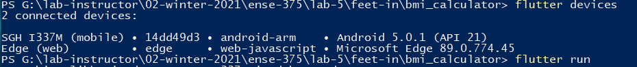

From here, when you try to run Android apps, they will be built with Gradle and deployed to your device.

</details>

---

## Optional 2: Android Emulator on Windows with Android Studio

<details>
<summary>Click to expand this section</summary>

Please note, using Android Emulator leverages a different type of virtualization technology than Docker. If you have configured your computer to use Docker, you may not be able to use this type of virtualization simultaneously.

If you would like to emulate an android device to test Flutter, you can follow the guide here:

[Windows](https://flutter.dev/docs/get-started/install/windows)
[Mac](https://flutter.dev/docs/get-started/install/macos)
[Linux](https://flutter.dev/docs/get-started/install/linux)

Follow the guide until you have installed Android studio.

Next you will need to create an android emulator using AVD,

Once created, start the emulator. You can check if flutter can access it using:

```
flutter devices
```

From here, when you try to run Android apps, they will be built with Gradle and deployed to the androld emulator.

</details>

---


## Optional 3: iOS Simulator on Mac

<details>
<summary>Click to expand this section</summary>

If you are on mac and have Xcode installed, you can start up the iOS Simluator from the terminal:

```
open -a simulator
```

And confirm that it is connected using...

```
flutter devices
```

We will not cover deploying to an iOS device, as this requires an Apple Developer Account.

</details>

---

## Hello World

Flutter provides a sample `Hello World` App, in `flutter/examples/hello_world/`. This example will work in both browser and on devices, whether real or virtual. `cd` into this directory, and then run the command:

```
flutter run
```

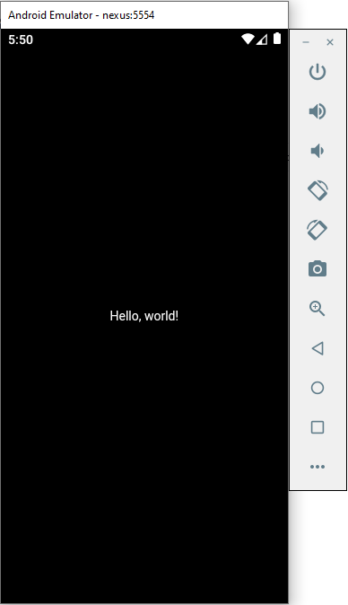

There are other sample projects included as well. For example, here is the flutter view application, found in `flutter/examples/flutter_view`.

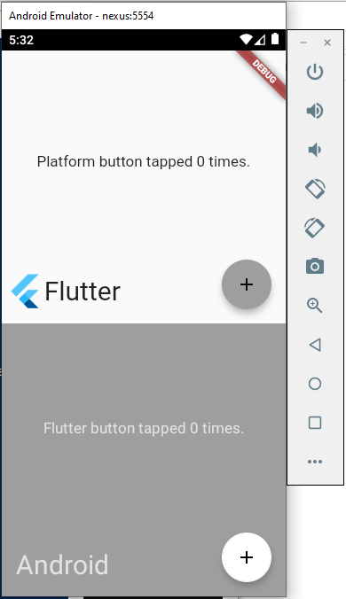

## The Dart programming language

Dart is a programming language made by Google for native app development. The key features of the language, summarized from [here](https://www.toptal.com/dart/dartlang-guide-for-csharp-java-devs), are:

- Sytax which is similar to Java and C#
- Python / JavaScript-like scripting capabilities
- Compiles to JavaScript for the web, Android and iOS

I'd add:
- Hot reload, allowing iterative development
- Great documentation and many tutorials

[Official Flutter / Dart docs](https://flutter.dev/docs).

### Null Safety

** Important ** Dart recently added explicit null safety, which has changed the syntax on some components. This new syntax will work on DartPad, where the newest version of dart is running, but not on Flutter, which is still using an older build.

[You can read about it here](https://dart.dev/null-safety)

The important take away, if you see structures like:
```
      onChanged: (String? newValue) {
        setState(() {
          dropdownValue = newValue!;
        });
```
In the current version of flutter this would be written as:

```
      onChanged: (String newValue) {
        setState(() {
          dropdownValue = newValue;
        });
```

## A simple App

For the pre-lab, we are going to create a BMI Calculator, which will be expanded for the assignment.

Open a terminal to the directory where you would like to create your sample application, and run the following command:

```
flutter create bmi_calculator
```

This will create a new directory, bmi_calculator, which includes source files for this project.

```
cd bmi_calculator
```

```
flutter run
```

This will consume this terminal - do not close this or your app will crash.

If you have already set up a physical device or emulator, this will deploy the starter app to your device or emulator. Note that it takes a while - Like, 5 to 7 minutes for some applications. Otherwise, it will open up in your browsesr, edge or chrome on windows.

Let's take a look at the code. Open up:

`lib/main.dart`

in your editor of choice.

```dart
import 'package:flutter/material.dart';

void main() {
  runApp(MyApp());
}

class MyApp extends StatelessWidget {
  // This widget is the root of your application.
...
```

This is dart code. Notice that the syntax is very similar to Java or C#.

Let's modify the string on the screen by changing the text at line 97:

from
```dart
Text(
  'You have pushed the button this many times:',
)
```

to
```dart
Text(
  'You have clicked the button this many times:',
)
```

To update the app without recompiling from scratch, go to your command window, and press `r`

## Adding functionality

Let's do a more significant demo. We are going to write a calculator for BMI:

[This is based off of this tutorial!](https://www.codementor.io/@nitishk72/flutter-bmi-calculator-app-1dlnjlhy6e)

Our goal is to implement this mockup:

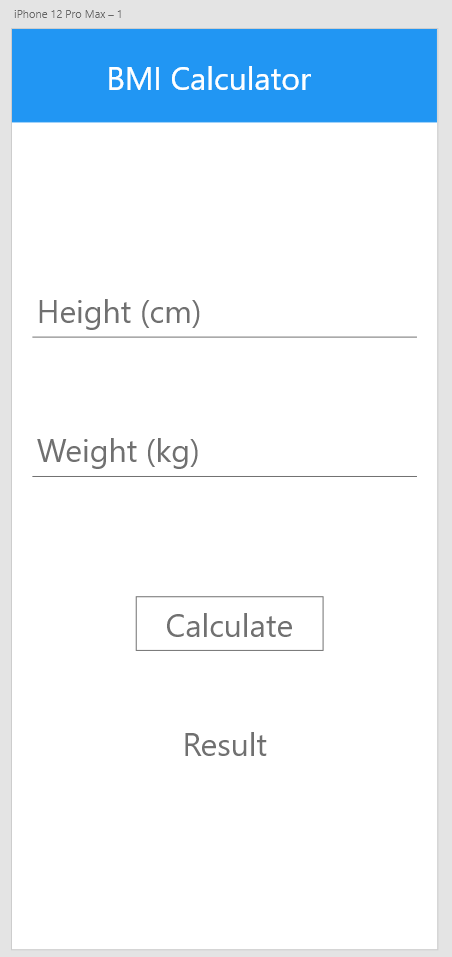

Let's start by setting up the project:

Paste this as your new main file...


<details>
<summary>expand main.dart</summary>

in `main.dart`
```dart
import 'package:flutter/material.dart';
import 'bmi.dart';

void main() {
   runApp(MyApp());
}

class MyApp extends StatelessWidget {
  @override
  Widget build(BuildContext context) {
    return MaterialApp(
      home: BMI(),
    );
  }
}


```

</details>

You can [learn more about what we are doing here](https://flutter.dev/docs/development/ui/widgets-intro).

We can consider this boilerplate. In summary:
- `void main()` is the main entry point
- The runApp function takes a widget
- In our app we are creating a new `home`, the BMI widget
- We will declare the BMI widget in a new file, bmi.dart
  - We import bmi.dart at the top of the file.

Create `lib/bmi.dart` and paste in the following:

<details>
<summary>expand bmi.dart</summary>

```dart
import 'package:flutter/material.dart';

class BMI extends StatefulWidget {
  @override
  _BMIState createState() => _BMIState();
}

class _BMIState extends State<BMI> {
   
  @override
  Widget build(BuildContext context) {
    return Scaffold(

    );
  }
}
```

</details>

This too can be considered boilerplate. Stateful widgets manager their own state, while Stateless ones do not.

- Widgets implement the `build` function which composes a widget out of flutter widgets.
- Some basic flutter widgets are:
  - Text
  - Rows and Columns
  - Stacks
  - Containers

Let's start by setting our appbar properties:

<details>
<summary>expand bmi.dart</summary>

```dart
import 'package:flutter/material.dart';

class BMI extends StatefulWidget {
  @override
  _BMIState createState() => _BMIState();
}

class _BMIState extends State<BMI> {
   
  @override
  Widget build(BuildContext context) {
    return Scaffold(
      appBar: AppBar(
        title: Text('BMI Calculator'),
        centerTitle: true,
      ),
    );
  }
}
```

</details>

We are at a point we can test our app! Open a terminal in your project directory, and run it with...

```
flutter run
```

If you are on Android, you will see Gradle building your app.

You may keep this terminal running, and upon making changes, update it with the `r` key.

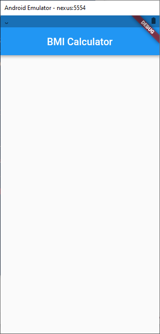

Next we need to add our components to our widget. These need to be put into a layout. [Learn about layouts and containers](https://flutter.dev/docs/codelabs/layout-basics)

Let's box in our mockup to see how we will need to create it with containers...

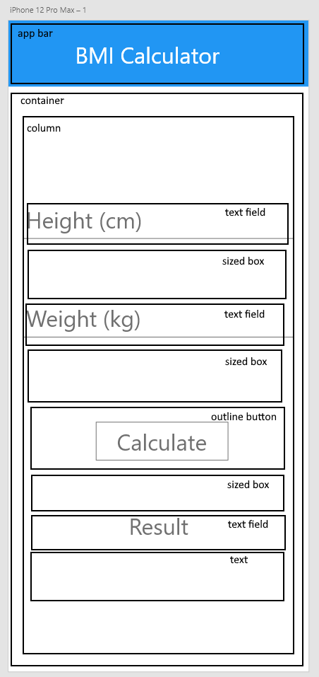

We can represent this UI as a tree...

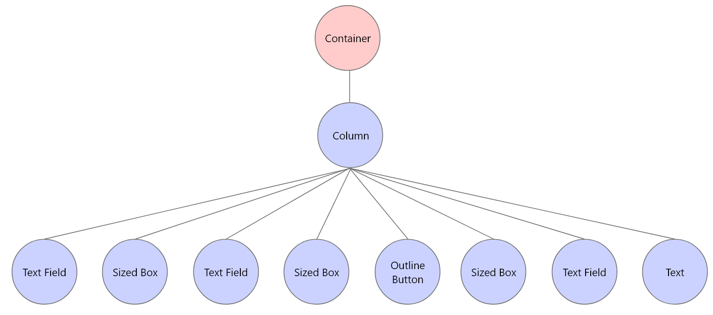

To implement this tree, we essentially create our widgets by an inorder traversal.

Next we want to create a container...

<details>
<summary>expand bmi.dart</summary>

```dart
import 'package:flutter/material.dart';

class BMI extends StatefulWidget {
  @override
  _BMIState createState() => _BMIState();
}

class _BMIState extends State<BMI> {
   
  @override
  Widget build(BuildContext context) {
    return Scaffold(
      appBar: AppBar(
        title: Text('BMI Calculator'),
        centerTitle: true,
      ),

      body: Container(
        padding: EdgeInsets.symmetric(horizontal: 10.0),
        child: Column(
          mainAxisAlignment: MainAxisAlignment.center,
          children: <Widget>[

          ],
        ),
      ),
    );
  }
}
```

</details>

We add the container to get some padding along the edges, and include a column inside so that we can add our components in order.

The children list will include each of our children in order.

Let's add a text widget...

<details>
<summary>expand bmi.dart</summary>

```dart
import 'package:flutter/material.dart';

class BMI extends StatefulWidget {
  @override
  _BMIState createState() => _BMIState();
}

class _BMIState extends State<BMI> {
  final TextEditingController _heightController = TextEditingController();

  @override
  Widget build(BuildContext context) {
    return Scaffold(
      appBar: AppBar(
        title: Text('BMI Calculator'),
        centerTitle: true,
      ),
      body: Container(
        padding: EdgeInsets.symmetric(horizontal: 10.0),
        child: Column(
          mainAxisAlignment: MainAxisAlignment.center,
          children: <Widget>[
            TextField(
              controller: _heightController,
              keyboardType: TextInputType.number,
              decoration: InputDecoration(
                labelText: 'height in cm',
              ),
            ),
          ],
        ),
      ),
    );
  }
}
```

</details>

When we create this text field, we are linking it to a variable `_heightController`, and opening the numeric keyboard when the user taps on it.  Be sure to include this variable type as a class member variable.

This code is getting loooong... The next few snippets will be added as children of the Column.

We want to add some spacing next...

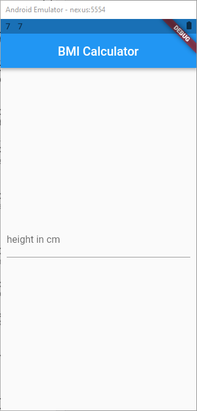

Notice that the elements are coming to the middle.

We want some space before the next widget, as...

```dart
            SizedBox(height: 50),
```

And add another TextField, with an appropriate controller:

```dart
...
  final TextEditingController _weightController = TextEditingController();
...

            TextField(
              controller: _weightController,
              keyboardType: TextInputType.number,
              decoration: InputDecoration(
                labelText: 'weight in kg',
              ),
            ),
```

we can restart to see our changes...

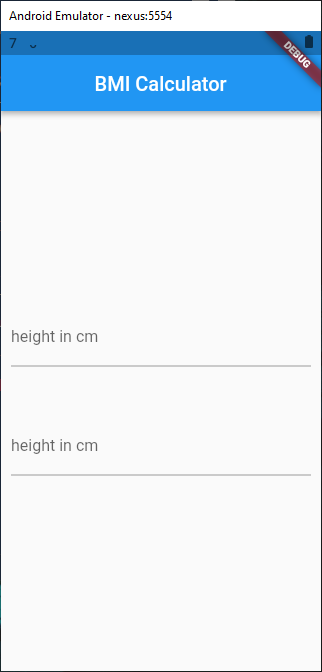

The next few components follow a similar pattern, so will just copy them in...

<details>
<summary>show demo.dart</summary>

```dart
import 'package:flutter/material.dart';

class BMI extends StatefulWidget {
  @override
  _BMIState createState() => _BMIState();
}

class _BMIState extends State<BMI> {
  final TextEditingController _heightController = TextEditingController();
  final TextEditingController _weightController = TextEditingController();

  double _result;

  @override
  Widget build(BuildContext context) {
    return Scaffold(
      appBar: AppBar(
        title: Text('BMI Calculator'),
        centerTitle: true,
      ),
      body: Container(
        padding: EdgeInsets.symmetric(horizontal: 10.0),
        child: Column(
          mainAxisAlignment: MainAxisAlignment.center,
          children: <Widget>[
            TextField(
              controller: _heightController,
              keyboardType: TextInputType.number,
              decoration: InputDecoration(
                labelText: 'height in cm',
              ),
            ),
            SizedBox(height: 50),
            TextField(
              controller: _weightController,
              keyboardType: TextInputType.number,
              decoration: InputDecoration(
                labelText: 'height in cm',
              ),
            ),
            SizedBox(height: 50),
            OutlineButton(
              child: Text(
                "Calculate",
              ),
              onPressed: calculateBMI,
            ),
            SizedBox(height: 50),
            Text(
              'Result'
            ),
            Text(
              _result == null ? "Enter Value" : "${_result.toStringAsFixed(2)}",
              style: TextStyle(
                color: Colors.redAccent,
                fontSize: 19.4,
                fontWeight: FontWeight.w500,
              ),
            ),
          ],
        ),
      ),
    );
  }
}
```

</details>

We did a couple of things here:
- we added a new result variable, `_result`, 
- we added a callback on our button to invoke a function when it is pressed.
  - We still need to create that function next.
- We used ternary assignment to assign our text box only when _result is set to a value

So now we need to write the function to actually compute our BMI...

This is a class function so we will include it in the class:

```dart
  void calculateBMI() {
    double heightInCM = double.parse(_heightController.text);
    double weightInKg = double.parse(_weightController.text);

    double heightInM = heightInCM / 100;

    double heightSquared = heightInM * heightInM;
    _result = weightInKg / heightSquared;
    setState(() {});
  }
```

Our application is complete!

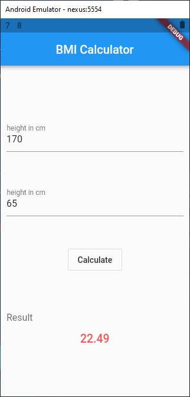

Now we need to test it, since this is a testing class...

We will be looking only at User Acceptance testing, since we haven't covered it yet in this lab, however, a full suite of testing utilities are provided for Flutter, with more information here:

[Testing in flutter](https://flutter.dev/docs/testing)

## User Acceptance Testing

User Acceptance testing is the final form of testing, where a real user, either the client or another user, physically walks through the expected actions and notes the outcome. To ensure test coverage is complete, it is a good idea to first make a systematic test plan, and then carry it out. These tests can be stored in a testing matrix.

## Test plan

Test matrices can be quite complex. Here is a simplified version. For each row we include:
1. A unique identifier for the test
2. The objective you wish to complete
3. The steps that are needed to achieve this object. Be specific if it may not be obvious otherwise
4. What is the Expected Result. Again, be specific!
5. What is the Actual Result?

| ID   | Objective   | Steps  | Expected Result  | Actual Result  | Pass
|   ---|    ---      |  ---   |    ---            |   ---          |---|
| 1  | Check a legal BMI  | Enter 170 cm and 65 kg  | 22.49  | 22.49 |✓ |
| 2  | ...  |   |   |   | |
| 3  | ...  |   |   |   | |

## Assignment

For your assignment, you are to continue with the BMI Application as follows:

Phase 1: Implementation

- You are to modify the application from metric to US Imperial
  
- Change the Height (cm) TextField into two dropdowns, with feet and inches.
  - The feet dropdown should allow numbers 3...7 inclusive
  - The inches dropdown should allow numbers 0..11 inclusive
- Change the Weight (kg) Text to Weight (lbs)
  
- You will need to modify the BMI formula to work with inches and lbs

- Some useful conversions:
  - 12 inches = 1 foot
  - 2.2 lbs = 1 kg
  - 2.54 cm = 1 inch

- Add a text box which displays the following depending on the weight range:
  
| range | meaning |
|---|---|
| < 18.5 | Underweight |
| 18.5 - 25 | Healhty Weight Range |
| 25 - 30| Overweight |
| > 30 | Severely Overweight |

- Check for errors. Add a warning box which outputs potential errors:
  - If no feet are selected, print "enter feet"
  - If no inches are selected, print "enter inches"
  - If no weight is entered, print "enter weight"
  - Only attempt to compute BMI if all three of these values are entered.

Here is a mockup of phase 2

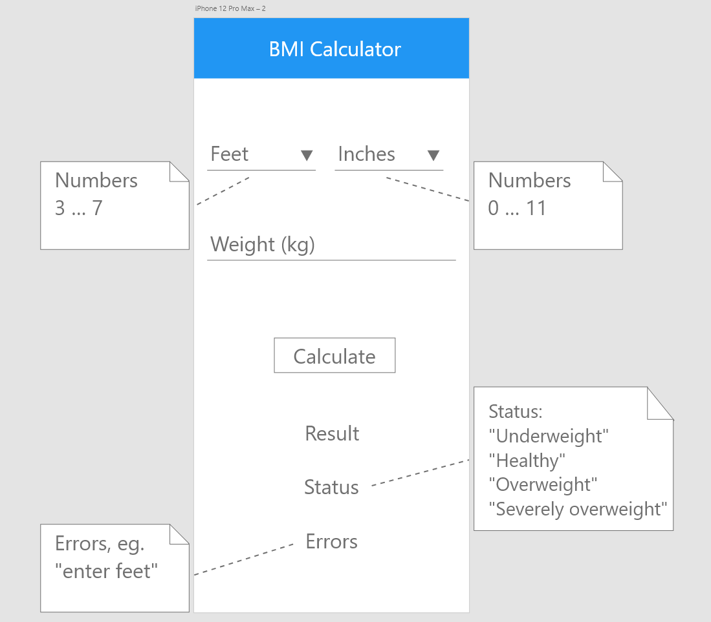

Here is a screenshot of phase 2, in a failure on Android...

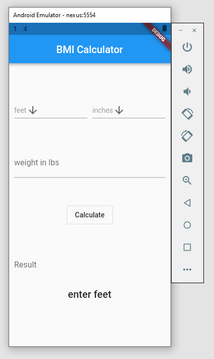

Here is phase 2 in a success state, tested in the browser...

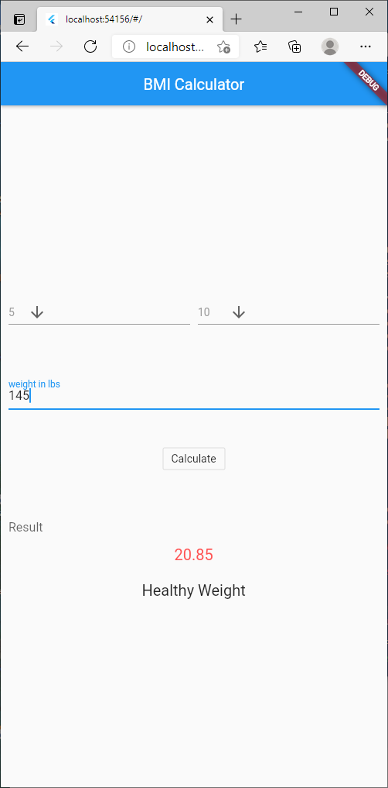

Note: You may wish to look up the following widgets:
[Row](https://flutter.dev/docs/codelabs/layout-basics)
[DropdownButton](https://api.flutter.dev/flutter/material/DropdownButton-class.html)

Phase 2: User Acceptance Testing matrix

Create and complete an User Acceptance Testing matrix, similar to the one shown in the previous section. Include tests for both happy paths and unhappy paths. You may wish to confirm with another BMI calculator, e.g. an online one, to see that your computed values are correct.

## Submission
Nothing to submit because you are using your GitHub repository.


---

## References

Flutter:

[Test Drive](https://flutter.dev/docs/get-started/test-drive?tab=terminal#create-app)

[User Interface](https://flutter.dev/docs/development/ui/widgets-intro)

[Widgets](https://flutter.dev/docs/development/ui/widgets-intro)

[Layout Basics](https://flutter.dev/docs/codelabs/layout-basics)

Dart:

S. Ford, [The Dart Language: When Java and C# Aren't Sharp Enough](https://www.toptal.com/dart/dartlang-guide-for-csharp-java-devs), 2019

BMI Tutorial:

N. Singh, [Flutter BMI Calculator App](https://www.codementor.io/@nitishk72/flutter-bmi-calculator-app-1dlnjlhy6e), 2020
